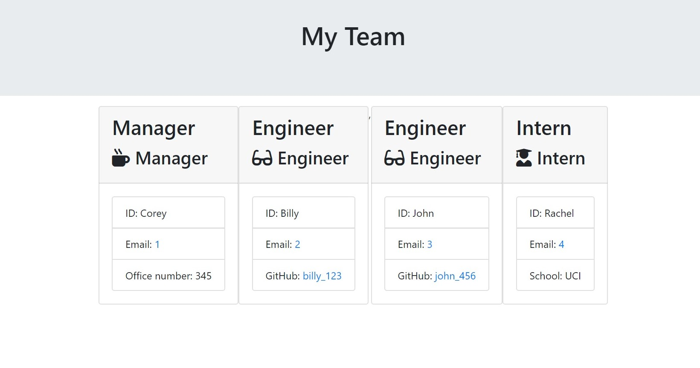

# 10-Team-Profile-Generator

## Description
As a Full-Stack Web Developer, I have created an application that will generate a team roster. I have created this application so that the manager will be able to locate employee information in one location. In order to achieve this, I will utilize node to generate data based on user input and push that data onto role specific cards inside an html file.

## Table of Contents

* [Title](#Title)
* [Description](#Description)
* [Installation](#Installation)
* [Usage](#Usage)
* [Contributing](#Contributing)
* [Tests](#Tests)

## Installation
Download "node" and run an "npm install" and "npm install inquirer".

## Usage
Start a new terminal, enter "node app.js", and answer the following prompts.

## Contributors
Just me!

## Tests
I ran tests for Employee.js, Manager.js, Engineer.js, and Intern.js to test the set up of each class and their constructors.

## Questions
Email: Coreyburkett22@gmail.com

